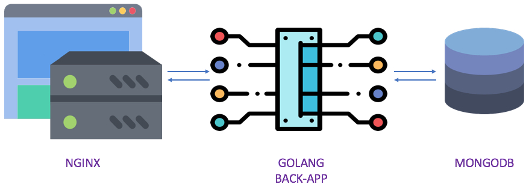

# Dockerized Golang REST API + MongoDB behind Nginx (Updated)



This is an updated, modernized version of the original project. It uses Go modules, modern Dockerfiles, docker-compose for local development, and HTTPS via Nginx.

## Forking this repo to your account

1. Click “Fork” on GitHub to fork the repository into your account
2. Clone your fork:
   ```bash
   git clone https://github.com/<your-username>/docker-golang-rest-mongodb-nginx.git
   cd docker-golang-rest-mongodb-nginx
   ```
3. (Optional) Set the original repo as upstream:
   ```bash
   git remote add upstream https://github.com/<original-owner>/docker-golang-rest-mongodb-nginx.git
   ```

## Prerequisites

- Docker Desktop (Windows/Mac/Linux)
- Ports 80 and 443 available locally

## Quick start (local)

```bash
docker compose up -d --build
```

Wait a few seconds, then test:

- Nginx health: `https://localhost/nginx-status`
- App health: `https://localhost/app-back-status`
- Contacts: `https://localhost/contacts`

Notes:
- This stack terminates TLS at Nginx with a self‑signed cert. Use `-k` with curl or accept the cert in your browser.
- The Go service listens on `:3000` and is only exposed behind Nginx.

## Services

- `mongodb`: official MongoDB image
- `app-back`: Golang REST API (modernized to Go modules, multi-stage build)
- `nginx`: reverse proxy terminating HTTPS and routing to the app

## Configuration

Application configuration is in `contacts-resapi/config.toml`:

```toml
server="mongodb:27017"
database="contacts_db"
```

If you run MongoDB elsewhere, change `server` accordingly.

## API

Health check:

```bash
curl -k https://localhost/app-back-status
```

List contacts:

```bash
curl -k https://localhost/contacts
```

Create contact:

```bash
curl -k -H "Content-Type: application/json" \
     -d '{"prenom":"Jane","nom":"Doe","telephone":"555-0101"}' \
     https://localhost/contacts
```

Get by id:

```bash
curl -k https://localhost/contacts/<id>
```

Update contact:

```bash
curl -k -X PUT -H "Content-Type: application/json" \
     -d '{"id":"<id>","prenom":"Jane","nom":"Doe","telephone":"555-0102"}' \
     https://localhost/contacts
```

Delete contact:

```bash
curl -k -X DELETE -H "Content-Type: application/json" \
     -d '{"id":"<id>"}' \
     https://localhost/contacts
```

## Development notes

- This repo replaces the legacy swarm `docker-stack.yml` with `docker-compose.yml` for local dev
- Go code updated to modules and multi-stage builds for reproducible images
- Nginx container bundles its config and self-signed certificates

## Troubleshooting

- If ports 80/443 are in use, stop the other services or change the exposed ports in `docker-compose.yml`
- If you previously deployed swarm services (like `myapp_*`), remove them:
  ```bash
  docker stack rm myapp
  ```

## License

MIT
